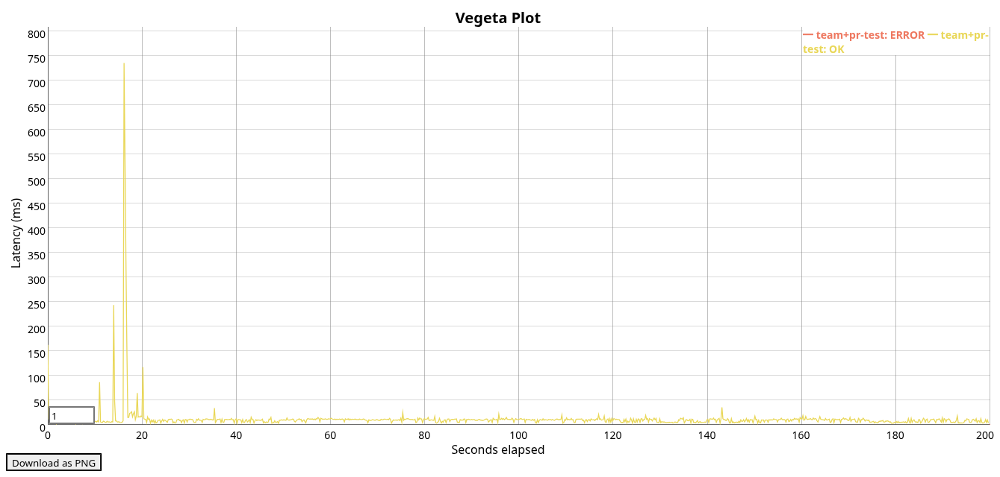

## Avito PR Review Service

Единый микросервис, который автоматически назначает ревьюеров на Pull Request’ы (PR), а также позволяет управлять командами и участниками.

[Подробное описание задания](https://github.com/avito-tech/tech-internship/blob/main/Tech%20Internships/Backend/Backend-trainee-assignment-autumn-2025/Backend-trainee-assignment-autumn-2025.md)

### Запуск

Запуск сервисов проекта осуществляется командой:

```bash
docker compose up
```

Взаимодействие с сервисом происходит по адресу http://localhost:8080

### Добавление миграции

Создать новую миграцию базы данных можно командой:

```bash
migrate create -ext sql -dir internal/repo/postgres/migrations -seq migration_name
```

Миграция будет применена автоматически при следующем запуске docker compose с флагом `--build`.

### Юнит-тестирование

Запуск юнит-тестов бизнес-логики осуществляется командой:

```bash
go test ./internal/service/...
```

Покрытие бизнес-логики тестами составляет 52.8%.

Чтобы посмотреть его детальнее, можно воспользоваться командами:

```bash
go test -coverprofile=coverage.out ./internal/service/...
go tool cover -func=coverage.out
```

### Нагрузочное тестирование

### Результаты



| Тип метрики                 | Значение |
| --------------------------- | -------- |
| Продолжительность           | 300s     |
| Число запросов              | 1002     |
| Rate                        | 5 rps    |
| SLI успеха                  | 99.80%   |
| SLI latency (95 перцентиль) | 14.74ms  |

#### Запуск

Нагрузочное тестирование происходит в три этапа: заполнение базы данных, генерация запросов и запуск Vegata. Всё это выполняется в рамках отдельного `docker-compose` окружения (`./compose.loadtest.yml`).

Для запуска нагрузочного тестирования остановите production-сервисы и запустите контейнеры соответствующего окружения:

```bash
docker compose down
docker compose -f compose.loadtest.yml down -v
docker compose -f compose.loadtest.yml up
```

После получения репорта в stdout остановите Docker Compose. Результаты тестирования будут лежать в директории `./result`. Далее их можно сконвертировать в график или CLI-представление командами:

```bash
cat result/vegeta_results.bin | vegeta report
vegeta plot result/vegeta_results.bin > results.html
xdg-open results.html
```

### Пояснения к решению

#### Секреты в compose-файле

Чтобы максимально упростить работу проверяющим, все секреты были оставлены в docker compose файле как есть.

В будущем перед деплоем в продакшн переменные были бы вынесенны в `docker secrets` или иное хранилище секретов, предусмотренное проектом.

#### Предпочтительный Primary key для таблицы команд (teams)

В качестве первичного ключа было решено использовать числовой-`serial` идентификатор для более быстрой идексации и возможности легко изменять имена команд в будущем.

#### Эндпоинты удаления сущностей

Функционал удаления сущностей был опущен в силу желания строго соответствовать требованиям прикрепленной openapi-спецификации, оставляя возможность их будущего добавления посредством предусмотренных решением миграций.
